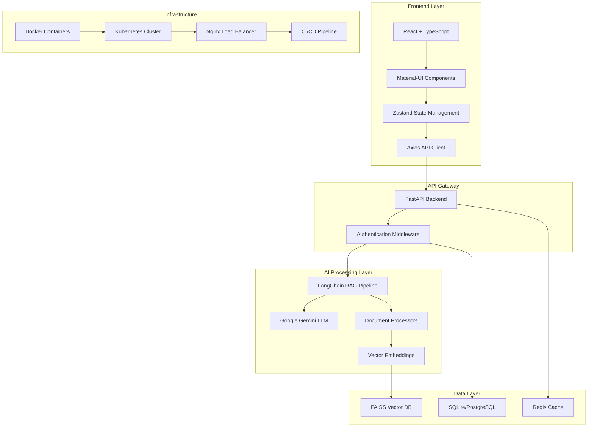

<div align="center">

# 🏛️ Intelligent Legal Research Assistant


**🚀 Revolutionary AI-driven legal research platform with advanced RAG capabilities, intelligent document processing, and semantic search powered by Google Gemini and LangChain.**

[🔥 Demo](https://your-demo-link.com) • [📖 Documentation](https://your-docs-link.com) • [🐛 Report Bug](https://github.com/your-username/legal-research-assistant/issues) • [✨ Request Feature](https://github.com/your-username/legal-research-assistant/issues)

---

</div>

## 🌟 Why Choose Our Legal Research Assistant?

<table>
<tr>
<td width="50%">

### 🎯 **Intelligent Document Processing**
- **Multi-format Support**: PDF, DOC, DOCX, TXT
- **Advanced RAG Pipeline**: Powered by LangChain & Google Gemini
- **Semantic Search**: FAISS vector database for instant retrieval
- **Auto-vectorization**: Documents processed automatically

</td>
<td width="50%">

### 🤖 **AI Agent Ecosystem**
- **Wikipedia Integration**: Comprehensive legal research
- **Case Law Analysis**: Precedent identification & analysis
- **Citation Formatting**: Bluebook, APA, MLA standards
- **Contract Analysis**: Risk assessment & key term extraction

</td>
</tr>
<tr>
<td width="50%">

### ⚡ **Performance & Scale**
- **Async Architecture**: FastAPI + SQLAlchemy for speed
- **Real-time Processing**: Background task queue with Celery
- **Docker Ready**: Full containerization support
- **Kubernetes**: Production-ready orchestration

</td>
<td width="50%">

### 🎨 **Modern UI/UX**
- **Material-UI Design**: Professional, accessible interface
- **Responsive Layout**: Works on all devices
- **Real-time Chat**: Conversational RAG interface
- **Drag & Drop**: Intuitive document upload

</td>
</tr>
</table>

## 🏗️ Architecture Overview



## 🚀 Quick Start

### 🔧 Prerequisites

<details>
<summary><strong>📋 System Requirements</strong></summary>

- **Python**: 3.9+ 
- **Node.js**: 18+
- **Memory**: 8GB+ RAM recommended
- **Storage**: 2GB+ free space
- **OS**: Windows 10+, macOS 10.15+, or Linux

</details>

### ⚡ One-Click Setup

```bash
# Clone the repository
git clone https://github.com/your-username/legal-research-assistant.git
cd legal-research-assistant

# Run the setup script
./scripts/setup.sh
```

### 🔑 Environment Configuration

Create your `.env` file:

```bash
# Backend configuration
cp backend/.env.example backend/.env

# Add your Google Gemini API key
GOOGLE_API_KEY=your_actual_api_key_here
```

<details>
<summary><strong>🔐 Get Google Gemini API Key</strong></summary>

1. Visit [Google AI Studio](https://makersuite.google.com/app/apikey)
2. Create a new API key
3. Copy and paste into your `.env` file

</details>

### 🏃‍♂️ Running the Application

<table>
<tr>
<td width="50%">

**🐳 Docker (Recommended)**
```bash
# Start all services
docker-compose up -d

# View logs
docker-compose logs -f
```

</td>
<td width="50%">

**💻 Local Development**
```bash
# Backend
cd backend && poetry install && poetry run python main.py

# Frontend (new terminal)
cd frontend && npm install && npm run dev
```

</td>
</tr>
</table>

### 🌐 Access Points

| Service | URL | Description |
|---------|-----|-------------|
| 🖥️ **Frontend** | http://localhost:3000 | Main application interface |
| 🔌 **API** | http://localhost:8000 | Backend API endpoints |
| 📚 **Docs** | http://localhost:8000/docs | Interactive API documentation |
| 📊 **Monitoring** | http://localhost:3001 | Application monitoring dashboard |

## 🎯 Key Features

<details>
<summary><strong>📄 Document Management</strong></summary>

- **Multi-format Upload**: Support for PDF, DOC, DOCX, TXT files
- **Bulk Processing**: Upload multiple documents simultaneously  
- **Automatic Parsing**: Extract text and metadata automatically
- **Version Control**: Track document changes and updates
- **Secure Storage**: Encrypted file storage with access controls

</details>

<details>
<summary><strong>🧠 RAG (Retrieval Augmented Generation)</strong></summary>

- **Conversational AI**: Natural language queries about your documents
- **Context Awareness**: Maintains conversation history for follow-up questions
- **Source Attribution**: See exactly which documents informed each response
- **Multi-document Analysis**: Query across your entire document library
- **Real-time Processing**: Instant responses with streaming support

</details>

<details>
<summary><strong>🤖 AI Agent Tools</strong></summary>

| Tool | Description | Use Cases |
|------|-------------|-----------|
| 📖 **Wikipedia Research** | Background research on legal topics | Case context, legal concepts |
| ⚖️ **Case Law Search** | Find relevant cases and precedents | Legal arguments, citations |
| 📜 **Statute Search** | Locate applicable laws and regulations | Compliance, legal research |
| 📝 **Citation Formatter** | Format citations in legal standards | Brief writing, documentation |
| 🔍 **Legal Analysis** | Comprehensive legal concept analysis | Case strategy, research |
| 📋 **Document Summary** | Extract key points from documents | Quick review, briefings |
| 📄 **Contract Analysis** | Identify risks and key terms | Due diligence, negotiations |
| ⏰ **Deadline Extraction** | Find important dates and deadlines | Calendar management, compliance |

</details>

<details>
<summary><strong>🔧 Research Workflows</strong></summary>

- **Pre-built Templates**: Ready-made workflows for common legal tasks
- **Custom Workflows**: Create your own multi-step research processes
- **Batch Processing**: Execute multiple tools in sequence
- **Report Generation**: Comprehensive research reports with citations

</details>

## 🛠️ Tech Stack

<div align="center">

### 🎨 Frontend Technologies


### ⚙️ Backend Technologies


### 🗄️ Data & AI


### 🚀 DevOps & Infrastructure


</div>

## 📊 API Reference

### 🔗 Core Endpoints

<details>
<summary><strong>📄 Document Management</strong></summary>

```http
POST   /api/documents/upload          # Upload documents
GET    /api/documents/documents       # List documents
DELETE /api/documents/documents/{id}  # Delete document
POST   /api/documents/query           # RAG query
GET    /api/documents/search/{query}  # Semantic search
```

</details>

<details>
<summary><strong>🤖 AI Agents</strong></summary>

```http
GET    /api/agents/tools              # List available tools
POST   /api/agents/execute            # Execute specific tool
POST   /api/agents/research-workflow  # Run research workflow
GET    /api/agents/workflow-templates # Available templates
```

</details>

<details>
<summary><strong>🔍 Search & Analysis</strong></summary>

```http
POST   /api/search/documents          # Search documents
POST   /api/analysis/case             # Analyze cases
POST   /api/citations/format          # Format citations
```

</details>

## 🚀 Deployment

### 🐳 Docker Deployment

```yaml
# docker-compose.yml
version: '3.8'
services:
  frontend:
    build: ./frontend
    ports: ["3000:3000"]
  
  backend:
    build: ./backend
    ports: ["8000:8000"]
    environment:
      - GOOGLE_API_KEY=${GOOGLE_API_KEY}
  
  postgres:
    image: postgres:15
    environment:
      - POSTGRES_DB=legaldb
  
  redis:
    image: redis:7-alpine
```

### ☸️ Kubernetes Deployment

```bash
# Deploy to Kubernetes
kubectl apply -f k8s/

# Check deployment status
kubectl get pods -n legal-research
```

### 🌐 Production Setup

<details>
<summary><strong>📋 Production Checklist</strong></summary>

- [ ] Set up SSL certificates
- [ ] Configure environment variables
- [ ] Set up monitoring and logging
- [ ] Configure backup strategies
- [ ] Set up CI/CD pipelines
- [ ] Security audit and penetration testing
- [ ] Performance optimization
- [ ] Set up error tracking

</details>
- **Google Gemini**: Large language model for AI capabilities
- **Sentence Transformers**: Text embeddings

### Frontend
- **React + TypeScript**: Modern web framework
- **Tailwind CSS**: Utility-first CSS framework
- **Material-UI**: Component library
- **Zustand**: State management
- **Framer Motion**: Animations
- **Axios**: HTTP client

## Getting Started

### Prerequisites

- Python 3.9+
- Node.js 18+
- Poetry (Python package manager)
- npm or yarn

### Backend Setup

1. Navigate to the backend directory:
```bash
cd backend
```

2. Install dependencies:
```bash
poetry install
```

3. Set up environment variables:
```bash
cp .env.example .env
# Edit .env with your API keys
```

4. Initialize the database:
```bash
poetry run python init_db.py
```

5. Start the server:
```bash
poetry run uvicorn main:app --reload
```

Or use the startup script:
- Windows: `start_backend.bat`
- Linux/Mac: `bash start_backend.sh`

### Frontend Setup

1. Navigate to the frontend directory:
```bash
cd frontend
```

2. Install dependencies:
```bash
npm install
```

3. Create environment file:
```bash
echo "VITE_API_URL=http://localhost:8000" > .env
```

4. Start the development server:
```bash
npm run dev
```

Or use the startup script:
- Windows: `start_frontend.bat`

## Configuration

### Environment Variables

#### Backend (.env)
- `GOOGLE_API_KEY`: Your Google Gemini API key
- `DATABASE_URL`: SQLite database path (default: sqlite+aiosqlite:///./legal_research.db)
- `VECTOR_DB_PATH`: FAISS vector database directory
- `SECRET_KEY`: JWT secret key
- `ALLOWED_ORIGINS`: Frontend URLs for CORS

#### Frontend (.env)
- `VITE_API_URL`: Backend API URL (default: http://localhost:8000)

## API Documentation

Once the backend is running, visit:
- Swagger UI: http://localhost:8000/docs
- ReDoc: http://localhost:8000/redoc

## Key Features Explained

### 1. Semantic Search
- Uses Sentence Transformers to create embeddings
- FAISS vector database for efficient similarity search
- AI-enhanced query expansion with Google Gemini

### 2. Legal Document Analysis
- Automatic extraction of key holdings and legal issues
- Precedent identification and conflict detection
- Similarity scoring between cases

### 3. AI-Powered Document Generation
- Template-based document creation
- Context-aware legal language generation
- Customizable document templates

### 4. Citation Management
- Multi-format citation support (Bluebook, APA, MLA)
- Automatic citation validation
- Format standardization

## Project Structure

```
legal-research-assistant/
├── backend/
│   ├── app/
│   │   ├── core/          # Configuration and database
│   │   ├── models/        # Database models and schemas
│   │   ├── routers/       # API endpoints
│   │   └── services/      # Business logic (AI, vector DB)
│   ├── main.py           # FastAPI application
│   ├── init_db.py        # Database initialization
│   └── pyproject.toml    # Python dependencies
└── frontend/
    ├── src/
    │   ├── components/    # React components
    │   ├── services/      # API clients
    │   ├── store/         # State management
    │   └── types/         # TypeScript types
    ├── package.json      # Node.js dependencies
    └── vite.config.ts    # Vite configuration
```

## Development

### Adding New Legal Documents
1. Add documents via the admin interface (planned)
2. Use the `/api/search/reindex` endpoint to rebuild the vector index
3. Documents are automatically embedded and indexed

### Extending AI Capabilities
- Modify `gemini_service.py` to add new AI features
- Update schemas in `models/schemas.py` for new data types
- Add corresponding API endpoints in the routers

### Customizing the Frontend
- Components are in `src/components/`
- State management uses Zustand stores
- Styling with Tailwind CSS and Material-UI

## Deployment

### Production Considerations
- Use PostgreSQL instead of SQLite for better performance
- Implement proper authentication and authorization
- Set up monitoring and logging
- Use Redis for caching and session storage
- Deploy with Docker for containerization

### Security
- JWT tokens for authentication
- CORS configuration for cross-origin requests
- Input validation and sanitization
- Rate limiting (planned)

## License

This project is licensed under the MIT License.

## Contributing

1. Fork the repository
2. Create a feature branch
3. Commit your changes
4. Push to the branch
5. Create a Pull Request

## Support

For questions and support, please open an issue on GitHub.

## 🆕 NEW FEATURES: Advanced RAG & Document Upload

This MVP now includes a comprehensive RAG (Retrieval Augmented Generation) pipeline with:

### Document Upload & Processing
- **Multi-format Support**: Upload PDF, DOC, DOCX, and TXT files
- **Automatic Vectorization**: Documents are automatically processed and added to FAISS vector database
- **Smart Chunking**: Text is intelligently split for optimal retrieval
- **Metadata Management**: File information stored in SQLite with easy management

### RAG Assistant Interface
- **Conversational AI**: Chat interface powered by Google Gemini and LangChain
- **Context Awareness**: Maintains conversation history for multi-turn dialogues
- **Source Attribution**: See which documents informed each response
- **Agent Integration**: Access to Wikipedia research and specialized legal tools

### AI Agent Tools
- **Wikipedia Research**: Background research on legal topics and concepts
- **Legal Case Search**: Find relevant cases and precedents
- **Statute Search**: Locate applicable statutes and regulations
- **Citation Formatting**: Proper legal citation formatting in various styles
- **Legal Analysis**: Comprehensive analysis of legal concepts and relationships
- **Document Summarization**: Extract key points and summaries from documents
- **Contract Analysis**: Identify risks, key terms, and obligations
- **Deadline Extraction**: Find and analyze important dates and deadlines

### Research Workflows
- **Pre-built Templates**: Basic research, contract review, case preparation workflows
- **Multi-tool Execution**: Combine multiple AI tools for comprehensive analysis
- **Batch Processing**: Execute multiple research tasks in sequence

### Enhanced UI Components
- **Document Upload Interface**: Drag-and-drop with progress tracking
- **RAG Chat Interface**: Modern chat UI with tool integration
- **Settings & Configuration**: Fine-tune RAG behavior and agent tools
- **Document Management**: View, organize, and manage uploaded documents

## 🚀 Quick Start with RAG Features

### 1. Get Google Gemini API Key
Visit [Google AI Studio](https://makersuite.google.com/app/apikey) to get your API key.

### 2. Backend Setup
```bash
cd backend
poetry install
cp .env.example .env
# Edit .env and add your GOOGLE_API_KEY
poetry run python init_db.py
poetry run python main.py
```

### 3. Frontend Setup
```bash
cd frontend
npm install
npm run dev
```

### 4. Upload Documents & Start Querying
1. Open http://localhost:5173
2. Go to "Document Upload" tab
3. Upload your legal documents (PDF, DOC, DOCX, TXT)
4. Switch to "RAG Assistant" tab
5. Start asking questions about your documents!

## 📖 Usage Examples

### RAG Queries
- "What are the key provisions in the contract I uploaded?"
- "Find cases similar to Smith v. Jones from my documents"
- "What deadlines are mentioned in these legal documents?"
- "Summarize the main legal issues in these cases"

### Agent Tools
- **Wikipedia**: "Research the legal concept of adverse possession"
- **Case Search**: "Find precedents for employment discrimination cases"
- **Legal Analysis**: "Analyze the enforceability of this non-compete clause"
- **Citation**: "Format this case citation in Bluebook style"

## 🔧 API Endpoints for RAG

### Document Management
- `POST /api/documents/upload` - Upload multiple documents
- `GET /api/documents/documents` - List all uploaded documents
- `DELETE /api/documents/documents/{id}` - Delete specific document
- `POST /api/documents/query` - RAG query interface
- `GET /api/documents/search/{query}` - Semantic similarity search
- `GET /api/documents/stats` - RAG pipeline statistics

### AI Agent Tools
- `GET /api/agents/tools` - List available agent tools
- `POST /api/agents/execute` - Execute specific agent tool
- `POST /api/agents/research-workflow` - Run comprehensive research workflow
- `GET /api/agents/workflow-templates` - Available workflow templates

## 🏗️ RAG Architecture

### Vector Pipeline
1. **Document Ingestion**: Upload via web interface or API
2. **Text Extraction**: Extract text from PDF, DOC, DOCX, TXT
3. **Chunking**: Split documents into semantic chunks
4. **Embedding**: Generate vector embeddings using Sentence Transformers
5. **Storage**: Store vectors in FAISS database with metadata in SQLite

### Query Pipeline
1. **Question Processing**: User query received via chat interface
2. **Vector Search**: Find most relevant document chunks
3. **Context Assembly**: Combine relevant chunks with query
4. **LLM Generation**: Google Gemini generates contextual response
5. **Response**: Return answer with source attribution

### Agent Integration
- **Tool Selection**: Choose appropriate tools based on query
- **External Research**: Wikipedia, legal databases (mock), statute search
- **Multi-step Reasoning**: Chain multiple tools for complex queries
- **Result Synthesis**: Combine tool outputs with document knowledge

## 🔒 Production Considerations

### Security
- Add authentication middleware in production
- Implement rate limiting for API endpoints
- Secure file upload validation
- Environment variable protection

### Performance
- Vector database optimization for large document sets
- Async processing for large file uploads
- Response caching for common queries
- Database indexing for metadata queries

### Scalability
- Replace SQLite with PostgreSQL for production
- Add Redis for session management and caching
- Implement background task processing with Celery
- Load balancing for high-traffic scenarios
