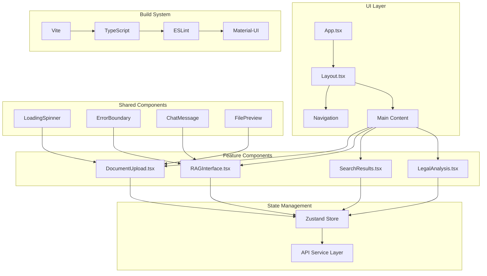

<div align="center">

# 🎨 Legal Research Assistant - Frontend


**✨ Modern, responsive React frontend with Material-UI design system, TypeScript safety, and AI-powered legal research interface.**

[🚀 Live Demo](https://your-app.vercel.app) • [📱 Mobile Preview](https://your-app.vercel.app/mobile) • [🎨 Storybook](https://your-storybook.vercel.app)

---

</div>

## 🏗️ Architecture Overview



## 🎯 Core Features

### 🎨 Modern UI/UX Design

<table>
<tr>
<td width="50%">

**🎭 Design System**
- Material-UI v5 components
- Consistent color palette
- Typography scale
- Responsive breakpoints
- Dark/light theme support

</td>
<td width="50%">

**📱 Responsive Layout**
- Mobile-first design
- Tablet optimization
- Desktop experience
- Cross-browser compatibility
- Touch-friendly interactions

</td>
</tr>
<tr>
<td width="50%">

**⚡ Performance**
- React 18 concurrent features
- Code splitting & lazy loading
- Optimized bundle size
- Fast refresh development
- Service worker caching

</td>
<td width="50%">

**🔒 Type Safety**
- TypeScript throughout
- Strict type checking
- Interface definitions
- Runtime type validation
- Enhanced IDE support

</td>
</tr>
</table>

### 🚀 Key Components

#### 📤 Document Upload Interface
- **Drag & drop functionality** with visual feedback
- **Multi-file support** with progress tracking
- **File validation** for legal document formats
- **Preview capabilities** for uploaded documents
- **Batch processing** with queue management

#### 💬 RAG Chat Interface
- **Conversational AI** with message history
- **Agent tool integration** with visual indicators
- **Real-time typing indicators** and loading states
- **Citation references** with clickable links
- **Export conversations** to various formats

#### 🔍 Advanced Search
- **Semantic search** with autocomplete
- **Filter by jurisdiction**, document type, date
- **Results ranking** with relevance scores
- **Search history** and saved queries
- **Boolean search operators** support

## 📁 Project Structure

```
frontend/
├── 🚀 index.html             # HTML entry point
├── 📋 package.json           # Dependencies and scripts
├── ⚙️ vite.config.ts         # Vite configuration
├── 🔧 tsconfig.json          # TypeScript configuration
├── 🎨 eslint.config.js       # ESLint rules
├── 🎯 .env.example           # Environment variables template
├── 📱 public/                # Static assets
│   ├── vite.svg
│   └── favicon.ico
│
├── 🎨 src/                   # Source code
│   ├── 🚀 main.tsx           # Application entry point
│   ├── 📱 App.tsx            # Root component
│   ├── 🎨 App.css            # Global styles
│   ├── 🎨 index.css          # Base CSS reset
│   ├── 🔧 vite-env.d.ts      # Vite type definitions
│   │
│   ├── 🧩 components/        # React components
│   │   ├── layout/
│   │   │   ├── Layout.tsx    # Main layout wrapper
│   │   │   ├── Header.tsx    # Navigation header
│   │   │   ├── Sidebar.tsx   # Navigation sidebar
│   │   │   └── Footer.tsx    # Application footer
│   │   │
│   │   ├── documents/
│   │   │   ├── DocumentUpload.tsx      # File upload interface
│   │   │   ├── DocumentList.tsx        # Document management
│   │   │   ├── DocumentPreview.tsx     # File preview modal
│   │   │   └── DocumentCard.tsx        # Document item display
│   │   │
│   │   ├── chat/
│   │   │   ├── RAGInterface.tsx         # Main chat interface
│   │   │   ├── ChatMessage.tsx          # Individual message
│   │   │   ├── MessageInput.tsx         # Input with send button
│   │   │   ├── AgentToolIndicator.tsx   # Tool execution status
│   │   │   └── ConversationHistory.tsx  # Chat history sidebar
│   │   │
│   │   ├── search/
│   │   │   ├── SearchBar.tsx            # Search input component
│   │   │   ├── SearchResults.tsx        # Results display
│   │   │   ├── SearchFilters.tsx        # Advanced filters
│   │   │   └── ResultCard.tsx           # Individual result item
│   │   │
│   │   ├── analysis/
│   │   │   ├── LegalAnalysis.tsx        # Analysis dashboard
│   │   │   ├── CaseAnalysis.tsx         # Case-specific analysis
│   │   │   ├── StatuteAnalysis.tsx      # Statute analysis
│   │   │   └── CitationFormatter.tsx    # Citation tools
│   │   │
│   │   └── shared/
│   │       ├── LoadingSpinner.tsx       # Loading indicators
│   │       ├── ErrorBoundary.tsx        # Error handling
│   │       ├── ConfirmDialog.tsx        # Confirmation modals
│   │       ├── Toast.tsx                # Notification system
│   │       └── IconButton.tsx           # Custom icon buttons
│   │
│   ├── 🗂️ hooks/             # Custom React hooks
│   │   ├── useApi.ts         # API interaction hook
│   │   ├── useDocuments.ts   # Document management
│   │   ├── useSearch.ts      # Search functionality
│   │   ├── useChat.ts        # Chat interface logic
│   │   └── useTheme.ts       # Theme management
│   │
│   ├── 🏪 store/             # State management
│   │   ├── index.ts          # Store configuration
│   │   ├── slices/
│   │   │   ├── documentsSlice.ts        # Document state
│   │   │   ├── chatSlice.ts             # Chat state
│   │   │   ├── searchSlice.ts           # Search state
│   │   │   ├── userSlice.ts             # User state
│   │   │   └── uiSlice.ts               # UI state
│   │   └── middleware/
│   │       ├── apiMiddleware.ts         # API integration
│   │       └── persistMiddleware.ts     # State persistence
│   │
│   ├── 🔌 services/          # External services
│   │   ├── api.ts            # Main API client
│   │   ├── documentService.ts # Document operations
│   │   ├── searchService.ts   # Search operations
│   │   ├── chatService.ts     # Chat operations
│   │   └── authService.ts     # Authentication
│   │
│   ├── 🎯 types/             # TypeScript type definitions
│   │   ├── api.ts            # API response types
│   │   ├── document.ts       # Document types
│   │   ├── chat.ts           # Chat message types
│   │   ├── search.ts         # Search result types
│   │   └── user.ts           # User types
│   │
│   ├── 🛠️ utils/             # Utility functions
│   │   ├── formatters.ts     # Data formatting
│   │   ├── validators.ts     # Input validation
│   │   ├── constants.ts      # Application constants
│   │   ├── helpers.ts        # Helper functions
│   │   └── api-client.ts     # API client configuration
│   │
│   ├── 🎨 theme/             # Material-UI theming
│   │   ├── index.ts          # Theme configuration
│   │   ├── colors.ts         # Color palette
│   │   ├── typography.ts     # Typography settings
│   │   └── components.ts     # Component overrides
│   │
│   └── 🖼️ assets/            # Static assets
│       ├── icons/            # SVG icons
│       ├── images/           # Images and logos
│       └── react.svg         # React logo
│
├── 📚 docs/                  # Documentation
│   ├── COMPONENT_GUIDE.md    # Component usage guide
│   ├── STATE_MANAGEMENT.md   # State management guide
│   └── DEPLOYMENT.md         # Deployment instructions
│
└── 🧪 tests/                 # Test files
    ├── components/           # Component tests
    ├── hooks/               # Hook tests
    ├── services/            # Service tests
    └── utils/               # Utility tests
```

## 🚀 Quick Start

### 📋 Prerequisites

```bash
# Node.js 18+
node --version

# npm or yarn or pnpm
npm --version
```

### ⚡ Installation

<details>
<summary><strong>📦 With npm (Recommended)</strong></summary>

```bash
# Install dependencies
npm install

# Install additional dev dependencies
npm install --save-dev @types/react @types/react-dom
```

</details>

<details>
<summary><strong>🧶 With Yarn</strong></summary>

```bash
# Install dependencies
yarn install

# Install additional dev dependencies
yarn add --dev @types/react @types/react-dom
```

</details>

<details>
<summary><strong>📦 With pnpm</strong></summary>

```bash
# Install dependencies
pnpm install

# Install additional dev dependencies
pnpm add -D @types/react @types/react-dom
```

</details>

### 🔧 Environment Setup

```bash
# Copy environment template
cp .env.example .env.local

# Edit configuration
nano .env.local
```

**Environment Variables:**

```bash
# API Configuration
VITE_API_BASE_URL=http://localhost:8000
VITE_API_TIMEOUT=30000

# Feature Flags
VITE_ENABLE_ANALYTICS=false
VITE_ENABLE_DEBUG=true

# Application Configuration
VITE_APP_NAME="Legal Research Assistant"
VITE_APP_VERSION=1.0.0

# External Services
VITE_GOOGLE_ANALYTICS_ID=your_ga_id_here
VITE_SENTRY_DSN=your_sentry_dsn_here
```

### 🏃‍♂️ Development Server

<table>
<tr>
<td width="50%">

**🔧 Development Mode**
```bash
# Start development server
npm run dev

# With specific port
npm run dev -- --port 3000

# With host binding
npm run dev -- --host 0.0.0.0
```

</td>
<td width="50%">

**🏗️ Build & Preview**
```bash
# Build for production
npm run build

# Preview production build
npm run preview

# Analyze bundle size
npm run build -- --analyze
```

</td>
</tr>
</table>

## 🎨 Component Library

### 📤 Document Upload Component

```tsx
import { DocumentUpload } from './components/documents/DocumentUpload';

function App() {
  const handleUpload = (files: File[]) => {
    console.log('Uploaded files:', files);
  };

  return (
    <DocumentUpload
      onUpload={handleUpload}
      acceptedTypes={['.pdf', '.doc', '.docx', '.txt']}
      maxFileSize={10 * 1024 * 1024} // 10MB
      maxFiles={5}
      showPreview={true}
    />
  );
}
```

**Features:**
- ✅ Drag & drop interface
- ✅ File type validation
- ✅ Size limit enforcement
- ✅ Progress tracking
- ✅ Preview capabilities
- ✅ Batch upload support

### 💬 RAG Chat Interface

```tsx
import { RAGInterface } from './components/chat/RAGInterface';

function ChatPage() {
  return (
    <RAGInterface
      enableAgentTools={true}
      maxMessageHistory={100}
      autoScroll={true}
      showTypingIndicator={true}
      enableFileUpload={true}
      enableExport={true}
    />
  );
}
```

**Features:**
- ✅ Real-time messaging
- ✅ Agent tool integration
- ✅ Message history
- ✅ File attachment
- ✅ Export conversations
- ✅ Typing indicators

### 🔍 Search Interface

```tsx
import { SearchBar, SearchResults } from './components/search';

function SearchPage() {
  const [query, setQuery] = useState('');
  const [results, setResults] = useState([]);

  return (
    <>
      <SearchBar
        value={query}
        onChange={setQuery}
        placeholder="Search legal documents..."
        showSuggestions={true}
        enableVoiceSearch={true}
      />
      <SearchResults
        results={results}
        loading={false}
        onResultClick={handleResultClick}
        showRelevanceScore={true}
      />
    </>
  );
}
```

## 🧪 Testing

### 🔬 Running Tests

```bash
# Run all tests
npm run test

# Run with coverage
npm run test:coverage

# Run specific test file
npm run test -- DocumentUpload.test.tsx

# Run with verbose output
npm run test -- --verbose
```

## 🚀 Build & Deployment

### 📦 Build Configuration

```bash
# Build for production
npm run build

# Preview production build
npm run preview

# Analyze bundle size
npm run build:analyze
```

### 🐳 Docker Deployment

```dockerfile
# Dockerfile
FROM node:18-alpine as builder

WORKDIR /app

# Copy package files
COPY package*.json ./
RUN npm ci --only=production

# Copy source code
COPY . .

# Build application
RUN npm run build

# Production stage
FROM nginx:alpine

# Copy built assets
COPY --from=builder /app/dist /usr/share/nginx/html

# Copy nginx configuration
COPY nginx.conf /etc/nginx/conf.d/default.conf

EXPOSE 80

CMD ["nginx", "-g", "daemon off;"]
```

## 🤝 Contributing

### ✅ Pull Request Checklist

- [ ] Tests pass: `npm run test`
- [ ] Type checking: `npm run type-check`
- [ ] Linting: `npm run lint`
- [ ] Build successful: `npm run build`
- [ ] Documentation updated

## 📚 Additional Resources

- 📖 [React Documentation](https://react.dev/)
- 🎨 [Material-UI Documentation](https://mui.com/)
- ⚡ [Vite Documentation](https://vitejs.dev/)
- 📘 [TypeScript Handbook](https://www.typescriptlang.org/docs/)

---

<div align="center">

**✨ Built with modern React ecosystem for exceptional user experience**

[⬆ Back to Top](#legal-research-assistant---frontend)

</div>
  {
    files: ['**/*.{ts,tsx}'],
    extends: [
      // Other configs...
      // Enable lint rules for React
      reactX.configs['recommended-typescript'],
      // Enable lint rules for React DOM
      reactDom.configs.recommended,
    ],
    languageOptions: {
      parserOptions: {
        project: ['./tsconfig.node.json', './tsconfig.app.json'],
        tsconfigRootDir: import.meta.dirname,
      },
      // other options...
    },
  },
])
```
